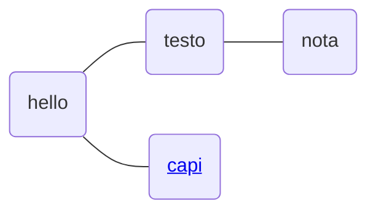

{Link: docsify-wikilink https://github.com/zpengg/docsify-wikilink}

# Prova con diagramma
## Mermaid

<mark>amici</mark>

[[Simplebookmarks.md]]

Offerte

[nota2](/%2F/nota2.md)
<!--stackedit_data:
eyJoaXN0b3J5IjpbNzQ4NDMzNDY5XX0=
-->
