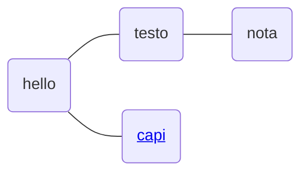

# Prova con diagramma
## Mermaid

```mermaid
 graph LR;

    node1(hello) --- node2(testo) & node3(<a href="https://www.markdownguide.org/">capi</a>)

    node2 --- node4(nota)
```
<mark>amici</mark>

[Simplebookmark](/%2F/nota2.md)

Offerte

[nota2](/%2F/nota2.md)
